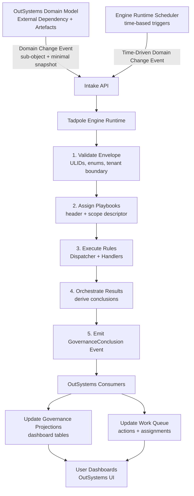

# Tadpole Engine Flow

Mermaid (current runtime path):

Notes:
- RabbitMQ is omitted in the current runtime; the intake API is the integration point.
- Intake accepts only domain change events (`event_category` Transaction/TimeDriven).
- The engine emits `GovernanceConclusion` events; trace data stays internal.
